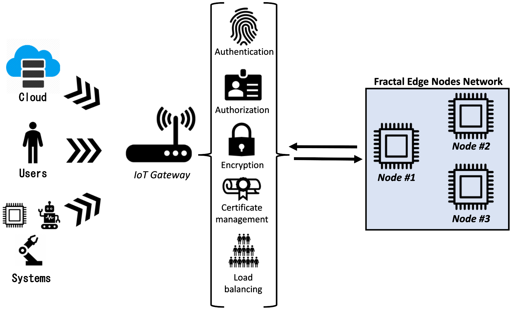

# WP4T44-05-iot-gateway

The IoT Gateway is a component that controls traffic and routing between the internal services in the Fractal Network (Edge devices) and external users and clients (Cloud services).

In this document, the instructions to set up an Apache APISIX Gateway in ARM devices is given, with installation steps, usage, and troubleshooting.

This component is related to WP4 - T4.4, Security Services for the Fractal environment, and it satifies the cybersecurity requirements for the Fractal platform and Edge environments, by acting as a single-point access to the exposed services, controlling and routing the traffic through user-defined rules, and providing security plugins for Authentication, Authorization, certificates management, etc.



In the above diagram you can see the architecture and how the IoT Gateway component acts as a centralized security entrypoint for your Fractal Edge Nodes network, providing several security components and plugins that can be used to build a custom security infrastructure.

### Prerequisites

* Docker Engine
* docker-compose
* A node of Fractal Plarform with ARM architecture

## Getting Started

See [Deployment](#deployment) for notes on how to deploy the component in a use case.

The configuration is done through the Configuration file `config.yaml`. Assuming you have installed Apisix via docker-compose, it should be located on `apisix-docker/example/apisix_conf`. In this configuration file many aspects can be customized to the Use case needs, like the port being exposed for communication or dashboard, the Admin API key (it is discouraged to use the default one), the TLS implementation and plugins enabled by default.

## Usage

In the Dasboard (by default at http://localhost:9000), many of the options that APISIX has to offer can be configured.

The alternative way of creating resources and routes is through the API, which is hosted by default at localhost:9080.

APISIX is based on routing communications between a Route (the entrypoint of a request, defining the matching rules between the client request and a service), Upstream (backend services), and Services (combination of plugins, routes and upstream targets). These objects can be combined with plugins that provide many security capabilities, from Authorization and Authentication to certificates, IP restrictions, URI blockers, etc.

```
# Create a route through the Admin API:

curl "http://127.0.0.1:9080/apisix/admin/routes/1" -H "X-API-KEY: edd1c9f034335f136f87ad84b625c8f1" -X PUT -d '
{
  "methods": ["GET"],
  "host": "Fractal-metrics",
  "uri": "/api/3/*",
  "upstream": {
    "type": "roundrobin",
    "nodes": {
      "<YOUR_BACKEND_IP>:<PORT>": 1
    }
  }
}'

# Create an Upstream through the Admin API:

{
  "uri": "/api/3/*",
  "upstream": {
    "type": "roundrobin",
    "nodes": [
      { "host": "127.0.0.1", "port": 61208, "weight": 1, "priority": -1 }
    ],
    "checks": {
      "active": {
        "http_path": "/status",
        "healthy": {
          "interval": 1,
          "successes": 1
        },
        "unhealthy": {
          "interval": 1,
          "http_failures": 1
        }
      }
    }
  }
}

```

Once the Route has been created, all the calls to the APISIX API that match the resources specified (/api/3/*, for instance) and coming from the correct host (fractal-metrics in this case) will be redirected to the backend Upstream service which is defined in the nodes section.

Example curl:

```
curl -i -X GET "http://127.0.0.1:9080/api/3/cpu" -H "Host: fractal-metrics"
```

### Securizing: plugins
*TBD*


## Deployment

The recommended way of installing APISIX on ARM devices is through the Docker containers. It can also be installed from source by following the instructions on the [Official Documentation](https://apisix.apache.org/docs/apisix/installation-guide/).

To deploy with docker-compose, first install the required packages:

```
sudo apt-get install \
    ca-certificates \
    curl \
    gnupg \
    lsb-release

sudo mkdir -p /etc/apt/keyrings

curl -fsSL https://download.docker.com/linux/ubuntu/gpg | sudo gpg --dearmor -o /etc/apt/keyrings/docker.gpg

echo \
  "deb [arch=$(dpkg --print-architecture) signed-by=/etc/apt/keyrings/docker.gpg] https://download.docker.com/linux/ubuntu \
  $(lsb_release -cs) stable" | sudo tee /etc/apt/sources.list.d/docker.list > /dev/null

 sudo apt-get update

 sudo apt-get install docker-ce docker-ce-cli containerd.io docker-compose-plugin

```

Then download the Apisix repository and start the docker-compose services:

```
git clone https://github.com/apache/apisix-docker.git
cd apisix-docker/example

docker-compose -p docker-apisix -f docker-compose-arm64.yml up -d
```

If the deployment is successful you should be able to access the APISIX Dashboard at http://localhost:9000


## Additional Documentation and Acknowledgments

* Helpful links: https://apisix.apache.org/docs/apisix/admin-api/
